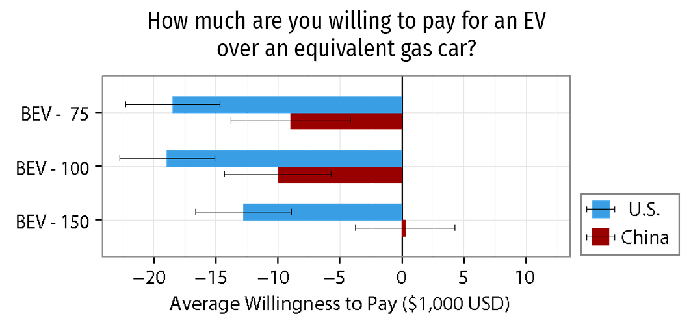
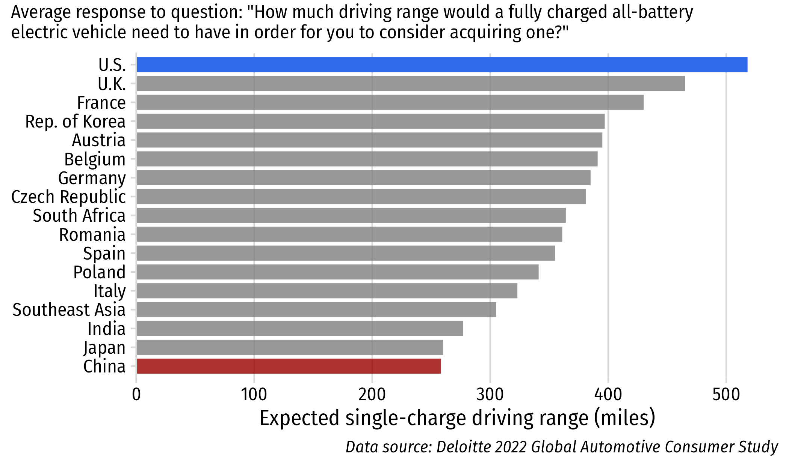
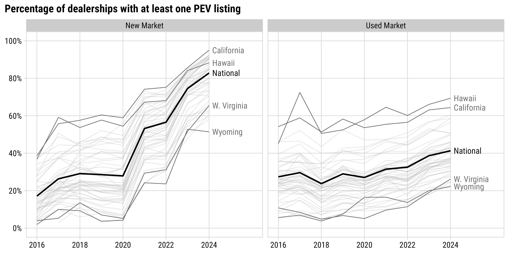
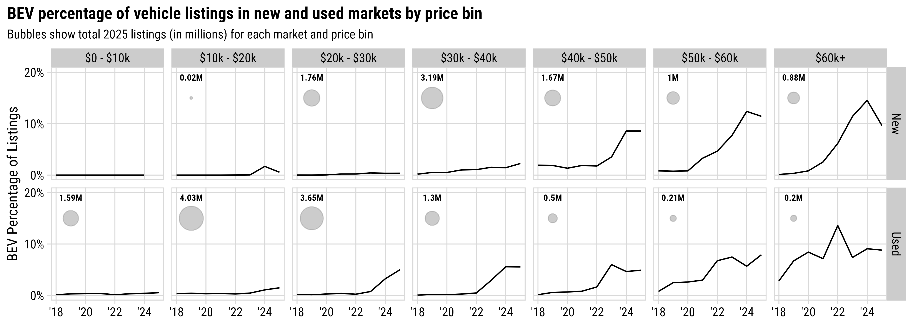
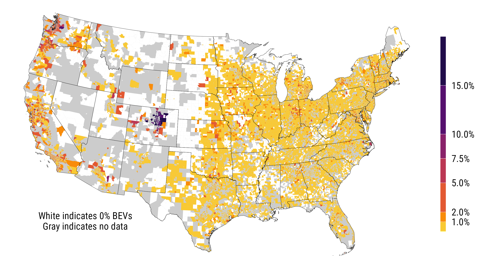
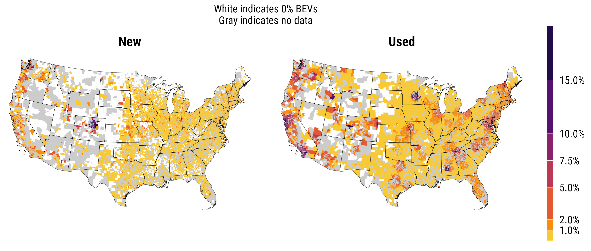
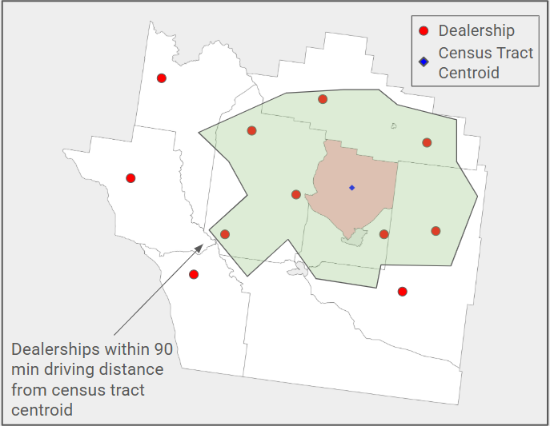
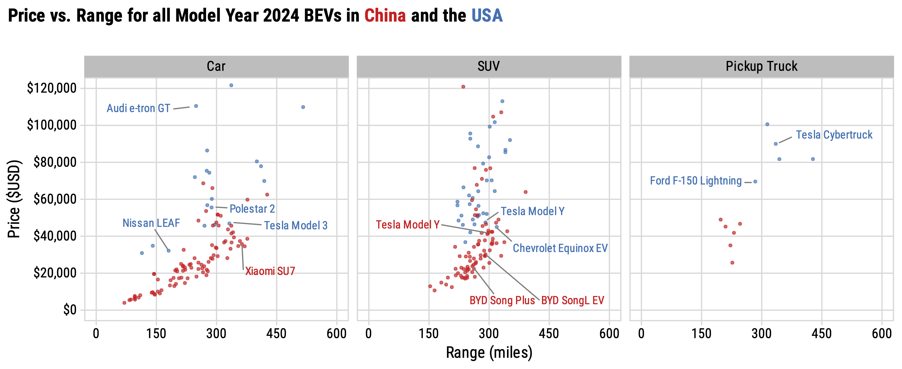

```{r, child="setup.Rmd"}
```

layout: true

<!-- this adds the link footer to all slides, depends on my-footer class in css-->

<div class="footer-small">
<span>
© John Paul Helveston, The George Washington University, May 2026
</span>
</div>

<!-- What are the barriers to EV adoption in the U.S.? -->
<!-- Consumer preferences - It’s harder to sell a BEV in America -->
<!-- Affordability barriers - supply-side challenges, gaps in availability of affordable EVs, used market is where we’re seeing better access to affordable EVs -->

---

background-image: url("images/blue.jpg")
background-size: cover
class: inverse

<br><br><br><br>

## `r rmarkdown::metadata$title`

<br><br><br><br>

**.white[John Paul Helveston]**, George Washington University

`r rmarkdown::metadata$date`

---

## .center[US buyers are more opposed to EVs than Chinese buyers]

<center>

</center>

.font80[Helveston et al. (2015) "Will subsidies drive electric vehicle adoption? Measuring consumer preferences in the U.S. and China" _Transportation Research Part A: Policy and Practice_. 73, 96–112. DOI: [10.1016/j.tra.2015.01.002](https://www.sciencedirect.com/science/article/abs/pii/S0965856415000038)]

---

class: center, middle 

### US buyers demand far more driving range than Chinese buyers

<center>

</center>

---

background-image: url("images/top-four-1.png")
background-size: cover

---

background-image: url("images/top-four-2.png")
background-size: cover

---

background-image: url("images/affordable_cars.png")
background-size: cover

https://www.nytimes.com/interactive/2026/04/13/opinion/affordable-car-cost.html


---

class: inverse, middle, center

# How many dealerships are carrying EVs?

---

class: center

## **4/5** dealers have _new_ BEV; **2/5** dealers have _used_ BEV

<center>

</center>

---

class: center

<br>

## **Majority of BEV listings in high-price segments**

<center>

</center>

---

background-color: #fff
class: center

# The EV "Deserts" of America

<center>

</center>

.font90[.left[Data: **128 M vehicle listings** from 60k dealerships (2016 - 2025), marketcheck.com]]

---

background-color: #fff
class: center

# The EV "Deserts" of America

<center>

</center>

.font90[.left[Data: **128 M vehicle listings** from 60k dealerships (2016 - 2025), marketcheck.com]]

---

class: inverse 
background-image: url("images/blue.jpg")
background-size: cover

<br>

# Thanks!

<br>

### Slides available at <span class="white-text">jhelvy.com/slides</span>

<style>
.white-text a {
  color: white !important;
}
</style>

.footer-large[.white[.right[

@jhelvy `r fa(name = "github", fill = "white")`<br>
jhelvy.com `r fa(name = "link", fill = "white")`<br>
jph@gwu.edu `r fa(name = "paper-plane", fill = "white")`<br>
@jhelvy.bsky.social `r fa(name = "bluesky", fill = "white")`

]]]

---

class: inverse, middle, center

# Extra Slides

---

### .center[**Local vehicle market**: Vehicles in 90 minute driving isochrone]

.leftcol40[

Combine ML algorithm of predicted household vehicle budget (using Census data) with local market characteristics

]

.rightcol60[

<center>

</center>

]

---

class: center

### China offers more affordable BEVs across all range categories

<center>

</center>

Data scraped from autocango.com (China) and carsheet.io (USA)

Interactive version at https://jhelvy.github.io/science-2025/
